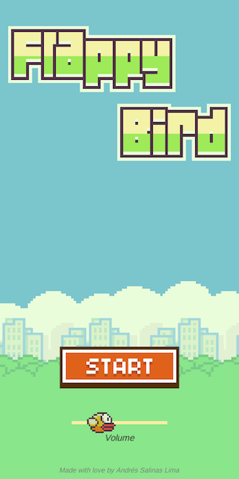
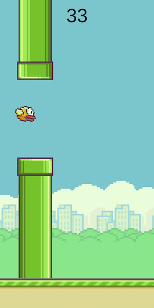
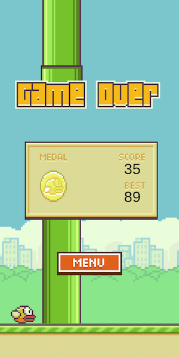

# Unity2D Flappy Bird

**Final assignment for the "Interfaces and Peripherals" course**

Recreation of the Flappy Bird game made with Unity2D (***Unity 2019.2.17f1***).

It's meant to be built for (and has been tested on) Android, but it also works on Unity Editor or Standalone Apps (PC/Mac/Linux) and should work on iOS.

Unity's Platform Dependent Compilation feature was used so you can control the flappy bird by pressing the spacebar if you are on a computer or by tapping the touchscreen if you are on a mobile device.

Go download the .apk from the [releases page](https://github.com/AndresSalinas97/Unity2D-Flappy-Bird/releases) and try it out!!

